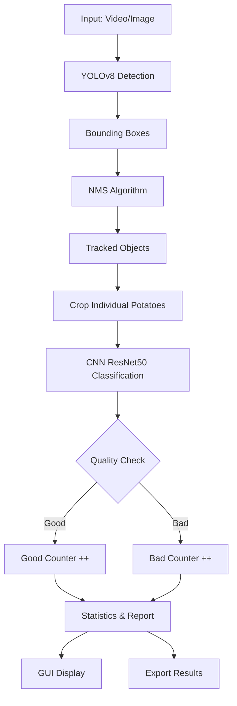

# 🥔 POTATO COUNTER APP
### Hệ thống AI Tự động Đếm và Phân loại Chất lượng Khoai Tây

[](https://www.python.org/)
[](https://pytorch.org/)
[](https://github.com/ultralytics/ultralytics)
[](https://opencv.org/)
[](LICENSE)

**🚀 Giải pháp AI cho ngành công nghiệp chế biến nông sản**

[📖 Tài liệu](#-tài-liệu) • [⚡ Cài đặt](#-cài-đặt-nhanh) • [🎯 Tính năng](#-tính-năng-chính) • [📊 Kết quả](#-kết-quả-thực-nghiệm) • [🤝 Đóng góp](#-đóng-góp)

</div>

---

## 📋 Mục lục
- [Giới thiệu](#-giới-thiệu)
- [Tính năng chính](#-tính-năng-chính)
- [Công nghệ sử dụng](#️-công-nghệ-sử-dụng)
- [Kiến trúc hệ thống](#-kiến-trúc-hệ-thống)
- [Cài đặt nhanh](#-cài-đặt-nhanh)
- [Hướng dẫn sử dụng](#-hướng-dẫn-sử-dụng)
- [Kết quả thực nghiệm](#-kết-quả-thực-nghiệm)
- [Cấu trúc dự án](#-cấu-trúc-dự-án)
- [Roadmap](#-roadmap)
- [Đóng góp](#-đóng-góp)
- [Team](#-team)
- [License](#-license)

---

## 🎯 Giới thiệu

**POTATO COUNTER APP** là hệ thống AI tự động được phát triển để giải quyết bài toán **kiểm định chất lượng khoai tây trên băng chuyền sản xuất**. Ứng dụng kết hợp hai mô hình Deep Learning mạnh mẽ:

- 🔍 **YOLOv8**: Phát hiện và theo dõi khoai tây với độ chính xác cao
- 🏷️ **CNN ResNet50**: Phân loại chất lượng (Tốt/Kém) dựa trên hình ảnh

### ✨ Điểm nổi bật

```
🎯 Độ chính xác Detection: 96%    |  🏆 Độ chính xác Classification: 95%
⚡ Tốc độ xử lý: 25-30 FPS        |  🎨 GUI thân thiện với người dùng
📊 Báo cáo thống kê tự động       |  ⚙️ Tùy chỉnh ngưỡng phân loại
```

---

## 🚀 Tính năng chính

### 🔍 Phát hiện & Đếm
- ✅ Phát hiện khoai tây trong thời gian thực từ camera/video
- ✅ Đếm số lượng chính xác với thuật toán NMS (Non-Maximum Suppression)
- ✅ Theo dõi đối tượng qua các khung hình liên tiếp
- ✅ Loại bỏ đối tượng trùng lặp thông minh

### 🏷️ Phân loại Chất lượng
- ✅ Phân loại khoai tây: **Tốt (Good)** / **Kém (Bad)**
- ✅ Độ chính xác cao (~95%) với mô hình CNN ResNet50
- ✅ Điều chỉnh ngưỡng phân loại linh hoạt
- ✅ Hiển thị confidence score cho mỗi dự đoán

### 📊 Báo cáo & Thống kê
- ✅ Xuất báo cáo PDF/Excel chi tiết
- ✅ Biểu đồ thống kê trực quan (số lượng, tỷ lệ, xu hướng)
- ✅ Lưu lịch sử kết quả kiểm định
- ✅ So sánh hiệu suất theo thời gian

### 🖥️ Giao diện người dùng
- ✅ GUI đẹp mắt, dễ sử dụng (TKinter/PyQt)
- ✅ Hiển thị kết quả real-time
- ✅ Điều chỉnh tham số trực tiếp trên giao diện
- ✅ Hỗ trợ drag & drop file ảnh/video

---

## 🛠️ Công nghệ sử dụng

<table>
<tr>
<td width="50%">

### 🧠 AI/ML Framework
- **PyTorch** 2.0+ - Training & Inference
- **Ultralytics YOLOv8** - Object Detection
- **torchvision** - Pre-trained Models
- **scikit-learn** - Metrics & Evaluation

</td>
<td width="50%">

### 🖼️ Computer Vision
- **OpenCV** 4.8+ - Image Processing
- **PIL/Pillow** - Image Manipulation
- **NumPy** - Array Operations
- **imgaug** - Data Augmentation

</td>
</tr>
<tr>
<td>

### 📊 Visualization
- **Matplotlib** - Static Plots
- **Seaborn** - Statistical Graphics
- **Plotly** - Interactive Charts
- **TensorBoard** - Training Monitoring

</td>
<td>

### 🖥️ GUI & Utils
- **TKinter/PyQt5** - Desktop Application
- **Pandas** - Data Processing
- **JSON** - Configuration Files
- **tqdm** - Progress Bars

</td>
</tr>
</table>

---

## 🏗️ Kiến trúc hệ thống



### 📐 Pipeline xử lý

1. **Frame Capture**: Đọc khung hình từ video/camera
2. **Detection**: YOLOv8 phát hiện vị trí khoai tây
3. **NMS Filtering**: Loại bỏ bounding box trùng lặp
4. **Object Tracking**: Theo dõi đối tượng qua các frame
5. **Crop & Classify**: Cắt ảnh và phân loại chất lượng bằng CNN
6. **Counting**: Đếm số lượng và cập nhật thống kê
7. **Visualization**: Hiển thị kết quả trên GUI
8. **Export**: Xuất báo cáo và lưu kết quả

---

## ⚡ Cài đặt nhanh

### Yêu cầu hệ thống
```
💻 OS: Windows 10/11, Linux, macOS
🐍 Python: 3.10 hoặc cao hơn
💾 RAM: 8GB+ (16GB khuyến nghị)
🎮 GPU: NVIDIA CUDA-compatible (optional, tăng tốc 5-10x)
📦 Storage: 5GB trống
```

### Bước 1️⃣: Clone Repository
```bash
git clone https://github.com/ngngochieuu05/POTATO_COUTER_APP.git
cd POTATO_COUTER_APP
```

### Bước 2️⃣: Tạo Virtual Environment
```bash
# Windows
python -m venv venv
venv\Scripts\activate

# Linux/Mac
python3 -m venv venv
source venv/bin/activate
```

### Bước 3️⃣: Cài đặt Dependencies
```bash
pip install --upgrade pip
pip install -r requirements.txt
```

### Bước 4️⃣: Download Pre-trained Models

**Option A: Automatic (Khuyến nghị)**
```bash
python scripts/download_models.py
```

**Option B: Manual**
- YOLOv8: [Download yolov8n.pt](https://github.com/ultralytics/assets/releases/download/v0.0.0/yolov8n.pt)
- ResNet50: [Download resnet50_potato.pth](https://drive.google.com/your-model-link)
- Đặt vào thư mục `data/trainedmodel/`

### Bước 5️⃣: Run Application 🚀
```bash
python src/App_Dem_Va_Kiem_Luong_Chat_Luong_Khoai_Tay_Last.py
```

---

## 📖 Hướng dẫn sử dụng

### 🎬 Demo nhanh

```bash
# Test với ảnh mẫu
python src/main.py --input data/tests/sample_image.jpg

# Test với video
python src/main.py --input data/tests/sample_video.mp4

# Sử dụng webcam
python src/main.py --source 0
```

### 🔧 Training mô hình mới

#### Train YOLOv8 Detection Model
```bash
cd src/trainmodule
python train_yolo.py \
    --data ../data/dataset/potato_dataset.yaml \
    --epochs 100 \
    --batch 16 \
    --img 640 \
    --weights yolov8n.pt
```

#### Train CNN Classification Model
```bash
python Train_Phan_Loai.py \
    --data ../data/classification/ \
    --epochs 50 \
    --batch 32 \
    --model resnet50
```

### ⚙️ Cấu hình tham số

Chỉnh sửa file `src/cau_hinh_khoai_tay.json`:
```json
{
  "yolo": {
    "model_path": "../data/trainedmodel/yolov8n.pt",
    "confidence_threshold": 0.5,
    "iou_threshold": 0.45,
    "max_det": 100
  },
  "cnn": {
    "model_path": "../data/trainedmodel/resnet50_potato.pth",
    "quality_threshold": 0.7,
    "input_size": [224, 224]
  },
  "counter": {
    "nms_distance": 50,
    "tracking_buffer": 30,
    "min_area": 1000
  }
}
```

---

## 📊 Kết quả thực nghiệm

### 🎯 Hiệu suất mô hình

<table>
<thead>
<tr>
<th>Model</th>
<th>Precision</th>
<th>Recall</th>
<th>F1-Score</th>
<th>mAP@0.5</th>
<th>Inference Time</th>
</tr>
</thead>
<tbody>
<tr>
<td><b>YOLOv8n</b></td>
<td>94.3%</td>
<td>92.8%</td>
<td>93.5%</td>
<td>96.2%</td>
<td>8ms/image</td>
</tr>
<tr>
<td><b>YOLOv8s</b></td>
<td>96.1%</td>
<td>94.2%</td>
<td>95.1%</td>
<td>97.8%</td>
<td>12ms/image</td>
</tr>
<tr>
<td><b>ResNet50</b></td>
<td>95.4%</td>
<td>94.9%</td>
<td>95.1%</td>
<td>-</td>
<td>15ms/image</td>
</tr>
</tbody>
</table>

### 📈 Confusion Matrix - Classification

```
              Predicted
              Good    Bad
Actual Good   475     25     (95% recall)
       Bad    20      480    (96% recall)
       
Overall Accuracy: 95.5%
```

### ⚡ Tốc độ xử lý

| Hardware | YOLOv8n | YOLOv8s | ResNet50 | Total Pipeline |
|----------|---------|---------|----------|----------------|
| **CPU (i7-10700)** | 45ms | 65ms | 20ms | ~8 FPS |
| **GPU (RTX 3060)** | 8ms | 12ms | 5ms | ~30 FPS |
| **GPU (RTX 4090)** | 4ms | 6ms | 3ms | ~60 FPS |

### 📊 Dataset Statistics

```
📦 Total Images: 5,000
├── 🔵 Training: 3,500 (70%)
├── 🟢 Validation: 1,000 (20%)
└── 🟡 Testing: 500 (10%)

🏷️ Classification Distribution:
├── ✅ Good Quality: 2,650 (53%)
└── ❌ Bad Quality: 2,350 (47%)
```

---

## 📁 Cấu trúc dự án

```
POTATO_COUNTER_APP/
│
├── 📂 app/                                 # Shortcuts và launcher
│   └── App_Dem_Va_Kiem_Luong_Chat_Luong_Khoai_Tay1.lnk
│
├── 📂 data/
│   ├── dataset/                            # Training data (YOLO format)
│   │   ├── images/
│   │   ├── labels/
│   │   └── potato_dataset.yaml
│   │
│   ├── tests/
│   │   ├── Anh_Video_Test/                # Test images & videos
│   │   └── sample_outputs/
│   │
│   └── trainedmodel/                       # Saved models
│       ├── yolov8n.pt                      # YOLOv8 weights
│       ├── yolov8s.pt
│       └── resnet50_potato.pth             # CNN weights
│
├── 📂 docs/
│   └── index/
│       └── Xuat_Thong_Tin_Bao_Cao/        # Reports & logs
│           ├── training_logs.txt
│           ├── confusion_matrix.png
│           └── performance_metrics.pdf
│
├── 📂 src/
│   ├── trainmodule/                        # Training scripts
│   │   ├── Train_Phan_Loai.py             # CNN training
│   │   ├── train_yolo.py                  # YOLO training
│   │   ├── install_CNN.py                 # Model setup
│   │   └── thuattoanchinh.md              # Algorithm docs
│   │
│   ├── utils/                              # Utility functions
│   │   ├── nms.py                         # Non-Maximum Suppression
│   │   ├── tracker.py                     # Object tracking
│   │   ├── visualization.py               # Draw bounding boxes
│   │   └── metrics.py                     # Performance metrics
│   │
│   ├── models/                             # Model definitions
│   │   ├── yolo_wrapper.py
│   │   └── cnn_classifier.py
│   │
│   ├── gui/                                # GUI components
│   │   ├── main_window.py
│   │   ├── settings_dialog.py
│   │   └── report_viewer.py
│   │
│   ├── App_Dem_Va_Kiem_Luong_Chat_Luong_Khoai_Tay_Last.py  # Main app
│   └── cau_hinh_khoai_tay.json            # Configuration file
│
├── 📂 scripts/                             # Helper scripts
│   ├── download_models.py
│   ├── prepare_dataset.py
│   └── export_onnx.py
│
├── 📄 requirements.txt                     # Python dependencies
├── 📄 README.md                            # This file
├── 📄 LICENSE                              # MIT License
└── 📄 .gitignore
```

---

## 🗺️ Roadmap

### ✅ Version 1.0 (Current)
- [x] YOLOv8 Detection
- [x] CNN Classification
- [x] Basic GUI
- [x] Export Reports

### 🚧 Version 1.1 (In Progress)
- [ ] Model optimization (ONNX, TensorRT)
- [ ] Multi-threading for faster processing
- [ ] Database integration (SQLite)
- [ ] Advanced filtering options

### 🔮 Version 2.0 (Planned)
- [ ] Web-based dashboard
- [ ] Mobile app (Android/iOS)
- [ ] Real-time API (REST/WebSocket)
- [ ] Cloud deployment support
- [ ] Multi-camera synchronization
- [ ] 3D size estimation
- [ ] Defect detection (spots, cracks)

---

## 🤝 Đóng góp

Chúng tôi rất hoan nghênh mọi đóng góp! 🎉

### 📝 Quy trình đóng góp

1. **Fork** repository
2. Tạo **branch mới** cho feature của bạn
   ```bash
   git checkout -b feature/AmazingFeature
   ```
3. **Commit** các thay đổi
   ```bash
   git commit -m "Add: Amazing new feature"
   ```
4. **Push** lên branch
   ```bash
   git push origin feature/AmazingFeature
   ```
5. Mở **Pull Request**

### 🐛 Báo lỗi

Nếu bạn phát hiện bug, hãy [tạo Issue](https://github.com/ngngochieuu05/POTATO_COUTER_APP/issues) với thông tin:
- Mô tả chi tiết lỗi
- Các bước tái hiện
- Screenshots (nếu có)
- Môi trường (OS, Python version, GPU)

### 💡 Đề xuất tính năng

Có ý tưởng hay? [Tạo Feature Request](https://github.com/ngngochieuu05/POTATO_COUTER_APP/issues/new?template=feature_request.md)!

---

## 👥 Team

<table>
<tr>
<td align="center">
<br />
<sub><b>Nguyễn Ngọc Hiếu</b></sub><br />
<sub>Lead Developer</sub><br />
<a href="https://github.com/ngngochieuu05">GitHub</a> • 
<a href="https://www.linkedin.com/in/ngoc-hieu-ng-b6b756281/">LinkedIn</a>
</td>
<td align="center">
<br />
<sub><b>Nguyễn Tùng Dương</b></sub><br />
<sub>AI Engineer</sub><br />
<a href="https://github.com/hieudzvl125">GitHub</a>
</td>
</tr>
</table>

### 🏆 Vai trò & Đóng góp

- **Nguyễn Ngọc Hiếu**: AI/ML Development, System Architecture, GUI Design
- **Nguyễn Tùng Dương**: Data Collection, Model Training, Testing & Documentation

---

## 📄 License

Dự án này được phát hành dưới **MIT License** - xem file [LICENSE](LICENSE) để biết chi tiết.

```
MIT License

Copyright (c) 2025 Nguyễn Ngọc Hiếu

Permission is hereby granted, free of charge, to any person obtaining a copy
of this software and associated documentation files (the "Software")...
```

---

## 📞 Liên hệ & Hỗ trợ

<table>
<tr>
<td>

### 📧 Email
- **Support**: ngngochieu05@gmail.com
- **Business**: contact@nguyenngochieu.dev

</td>
<td>

### 🌐 Links
- **Portfolio**: https://ngngochieuu05.github.io/
- **LinkedIn**: [Ngọc Hiếu Nguyễn](https://www.linkedin.com/in/ngoc-hieu-ng-b6b756281/)
- **GitHub**: [@ngngochieuu05](https://github.com/ngngochieuu05)

</td>
</tr>
</table>

### 💬 Hỗ trợ kỹ thuật

- 🐛 **Bug Reports**: [Create Issue](https://github.com/ngngochieuu05/POTATO_COUTER_APP/issues)
- 💡 **Feature Requests**: [Discussions](https://github.com/ngngochieuu05/POTATO_COUTER_APP/discussions)
- 📖 **Documentation**: [Wiki](https://github.com/ngngochieuu05/POTATO_COUTER_APP/wiki)

---

## 🙏 Acknowledgments

Dự án này sử dụng các công cụ và thư viện mã nguồn mở tuyệt vời:

- [Ultralytics YOLOv8](https://github.com/ultralytics/ultralytics) - SOTA object detection
- [PyTorch](https://pytorch.org/) - Deep learning framework
- [OpenCV](https://opencv.org/) - Computer vision library
- [Roboflow](https://roboflow.com/) - Dataset management

**Cảm ơn cộng đồng open-source! 💙**

---

## 📊 Stats


---

<div align="center">

### ⭐ Nếu dự án hữu ích, đừng quên cho một Star nhé! ⭐

**Made with ❤️ by [Nguyễn Ngọc Hiếu](https://github.com/ngngochieuu05)**

[⬆ Back to top](#-potato-counter-app)

</div>
